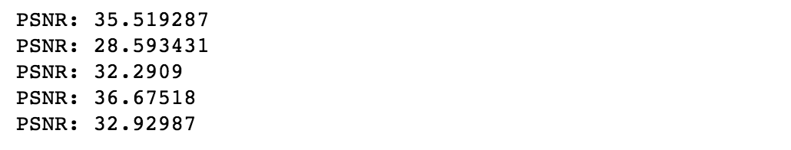
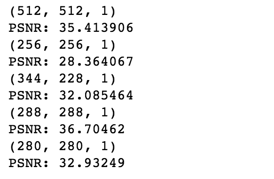

# 2019_DeepLearning
2019 CSE deep learning course

*This markdown is for Hanyang University Deep Learning course.
For more detailed information, please read reports below.*

## **Lab 1**
**Goal**

Build a 2-layered neural network for logistic regression. 

Implement the network using both numpy & tensorflow, and compare the results.

**Detail**
* Generate 128 2-dim vectors between -1 and 1.
* Train using Gradient descent.
* Repeat for 5000 times.
* For more detailed report, read [lab1.pdf](./lab1/lab1.pdf)

## **Lab 2**
**Goal**

Implement image super-resolution using CNN(SRCNN) with tensorflow.

**Detail**
* Made every sample pictures into half-size & grayscale.
* Trained cropped samples(32*32) with SRCNN, and compared the results with original pictures.
* For more detailed report, read [Lab2_report.pdf](./lab2/Lab2_report.pdf.pdf)

**Result**

## **Lab 4**

**Goal**

Implement SRCNN using vanilla RNN with tensorflow.

**Detail**
* Made every sample pictures into half-size & grayscale.
* Trained cropped samples(32*32) with SRCNN, and compared the results with original pictures.
* Used ReLU for activation function, and needed to calculate 'h' for RNN.
* For more detailed report, read [Lab4_report.pdf](./lab4/Lab4_report.pdf.pdf)

**Result**

## **Reference**
**Learning a Deep Convolutional Network for Image Super-Resolution** (ECCV 2014), C Dong et al.

**Image Super-Resolution Using Deep Convolutional Networks** (TPAMI 2015), C Dong et al.

